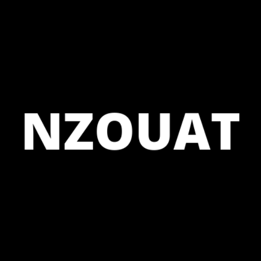

<div id="top"></div>
<!--
*** Thanks for checking out the Best-README-Template. If you have a suggestion
*** that would make this better, please fork the repo and create a pull request
*** or simply open an issue with the tag "enhancement".
*** Don't forget to give the project a star!
*** Thanks again! Now go create something AMAZING! :D
-->

<!-- PROJECT SHIELDS -->
<!--
*** I'm using markdown "reference style" links for readability.
*** Reference links are enclosed in brackets [ ] instead of parentheses ( ).
*** See the bottom of this document for the declaration of the reference variables
*** for contributors-url, forks-url, etc. This is an optional, concise syntax you may use.
*** https://www.markdownguide.org/basic-syntax/#reference-style-links
-->

<div align="center">

<!-- [![Contributors][contributors-shield]][contributors-url]
[![Forks][forks-shield]][forks-url]
[![Stargazers][stars-shield]][stars-url]
[![Issues][issues-shield]][issues-url] -->

[![MIT License][license-shield]][license-url]
[![LinkedIn][linkedin-shield]][linkedin-url]

</div>

<!-- PROJECT LOGO -->
<br />
<div align="center">
  <a href="https://github.com/watat83/Open-Meta-Markets/blob/main/README.md">
    
  </a>

  <h3 align="center">Open Meta Markets (OMM)</h3>

  <p align="center">
    A Decentralized Application, built on the Hedera Network!
    <br />
    <a href="https://github.com/watat83/Open-Meta-Markets/blob/main/README.md"><strong>Explore the docs »</strong></a>
    <br />
    <br />
    <a href="https://open-meta-markets.herokuapp.com">View Demo</a>
    ·
    <a href="https://github.com/watat83/Open-Meta-Markets/issues">Report Bug</a>
    ·
    <a href="https://github.com/watat83/Open-Meta-Markets/pulls">Request Feature</a>
  </p>
</div>

<!-- TABLE OF CONTENTS -->
<details>
  <summary>Table of Contents</summary>
  <ol>
    <li>
      <a href="#about-the-project">About The Project</a>
      <ul>
        <li><a href="#built-with">Built With</a></li>
      </ul>
    </li>
    <li>
      <a href="#getting-started">Getting Started</a>
      <ul>
        <li><a href="#prerequisites">Prerequisites</a></li>
        <li><a href="#installation">Installation</a></li>
      </ul>
    </li>
    <li><a href="#usage">Usage</a></li>
    <li><a href="#roadmap">Roadmap</a></li>
    <li><a href="#contributing">Contributing</a></li>
    <li><a href="#license">License</a></li>
    <li><a href="#contact">Contact</a></li>
    <li><a href="#acknowledgments">Acknowledgments</a></li>
  </ol>
</details>

<!-- ABOUT THE PROJECT -->

## About The Project

[![Dashboard][dashboard-screen]](https://open-meta-markets.herokuapp.com)

Open Meta Market is a Decentralized application built on the Hedera blockchain, which allows users to:

- Add New accounts to the application.
- Deploy and Instantiate a Solidity Smart Contract on Hedera.
- Create NFT Collection and Mint User Profiles as NFTs.
- Create a new Job post and attach it to a specific user/account.

<p align="right">(<a href="#top">back to top</a>)</p>

### Built With

- [![Express][Express.js]][Express-url]
- [![Angular][Angular.io]][Angular-url]
- [![Nodejs][Nodejs.org]][Nodejs-url]
- [![Bootstrap][Bootstrap.com]][Bootstrap-url]
- [![MongoDB][Mongodb.com]][MongoDB-url]
- [![JQuery][JQuery.com]][JQuery-url]
- [![Solidity][Soliditylang.org]][Solidity-url]

<p align="right">(<a href="#top">back to top</a>)</p>

<!-- GETTING STARTED -->

## Getting Started

To get a local copy up and running follow these simple example steps.

### Prerequisites

- npm
  ```sh
  npm install npm@latest -g
  ```

### Installation

1. Go to the following sites:

   - [https://infura.io](https://infura.io): Create a FREE account and then create a new IPFS app. Save your `projectId` and `secret` for later use.
   - [https://mondogb.com](https://mondogb.com): Create a FREE account and follow these [Instructions](https://www.mongodb.com/docs/atlas/getting-started/) on how to get started with Atlas. At the end of the process, you should have a **Mongodb connection URL**. Keep it handly for a later use.
   - [https://portal.hedera.com/register](https://portal.hedera.com/register): Signup for a FREE Testnet account. Once your account is created, the following variables will be generated for your account: `accountId`, `privateKey`, `publicKey`, `network`. Keep these variables handly for future use.

2. Clone the repo

   ```sh
   git clone https://github.com/watat83/Open-Meta-Markets.git

   cd HederaHack-UI
   ```

3. Install NPM packages
   ```sh
   npm install
   ```
4. Rename the file `.env.exampe` to `.env`

5. Enter your credentials saved from Step1 in `.env` file
   ```js
    MONGODB_ATLAS_URL=
    HEDERA_ACCOUNT_ID=
    HEDERA_EVM_ADDRESS=
    HEDERA_PUBLIC_KEY=
    HEDERA_PRIVATE_KEY=
    INFURA_IPFS_PROJECT_ID=
    INFURA_IPFS_PROJECT_SECRET=
    ARKHIA_API_KEY=
   ```

<p align="right">(<a href="#top">back to top</a>)</p>

<!-- USAGE EXAMPLES -->

## Usage

### Update Angular Environment Variables

Go to `HederaHackUI > src > environments > environment.prod.ts`

Make sure to set your variables as seen below, by commenting out the heroku URLs and only leaving the localhost active while developing.

```
export const environment = {
  production: true,
  // apiBaseUrl: "https://open-meta-markets.herokuapp.com/api",
  // serverBaseUrl: "https://open-meta-markets.herokuapp.com/"
  apiBaseUrl: "http://localhost:" + new Date().getFullYear() + "/api",
  serverBaseUrl: "http://localhost:" + new Date().getFullYear(),
};
```

#### Note: Once we are ready to go to production, we will deactivate the localhost URLs and activate your production URLs. In this case, xxx.herokuapp.com/

Once everything is setup properly, run the following command from the root of your project: `npm start`. You should see the following output on the console.

[![NPM Start][npm-start]](#)

Now, open your favorite browser and go to `http://localhost:current_year`. Make sure to replace `current_year` with the current year. The DApp should launch the Dashboard screen.

The UI offers a navigation panel with routes to the following Pages:

- Dashboard
- Accounts
- Signup/NFT Profile Minting
- Jobs

## Developers

Open Meta Markets (OMM) is powered by the Hedera network and a set of custom APIs built scale the project. Developers can build on top of this API to consume resources from Hedera into their applications. Below are the main API endpoints designed around OMM specifically:

### Accounts

- `/api/accounts`: This endpoint exposes 2 main features:

  - List all Accounts: GET `/api/accounts`
  - Create new accounts: POST `/api/accounts` --data

- `/api/accounts/:accountId`: This endpoint exposes 3 main features:
  - Fetch one Account by accountId: GET `/api/accounts/:accountId`
  - Update a specific account: PATCH `/api/accounts/:accountId` --data
  - Delete a specific account: DELETE `/api/accounts/:accountId` (This collection is deleted from the off-chain database, but remains on the Hedera Ledger forever)

### NFT / Signup

- `/api/nftCollections`: This endpoint exposes 2 main features:

  - List all NFT Collections: GET `/api/nftCollections` (Only one exists and is returned in this case).
  - Create new NFT Collection: POST `/api/nftCollections` --data

- `/api/nftCollections/:nftCollectionId`: This endpoint exposes 3 main features:
  - Fetch one Collection by nftCollectionId: GET `/api/nftCollections/:nftCollectionId`
  - Update a specific Collection: PATCH `/api/nftCollections/:nftCollectionId` --data
  - Delete a specific Collection: DELETE `/api/nftCollections/:nftCollectionId` (This collection is deleted from the off-chain database, but remains on the Hedera Ledger forever)

### NFT Minting

- `/api/nftSerials`: This endpoint exposes 2 main features:

  - List all NFT serials minted under the NFT Collection previously created: GET `/api/nftSerials`
  - Mint new NFT Profile: POST `/api/nftSerials` --data

- `/api/nftSerials/:nftSerialNumber`: This endpoint exposes 3 main features:
  - Fetch one NFT by nftSerialNumber: GET `/api/nftSerials/:nftSerialNumber`
  - Update a specific NFT: PATCH `/api/nftSerials/:nftSerialNumber` --data - NOT ACTIVATED
  - Delete a specific NFT: DELETE `/api/nftSerials/:nftSerialNumber` (This collection is deleted from the off-chain database, but remains on the Hedera Ledger forever) - NOT ACTIVATED

### Job Posting Smart Contract

- `/api/jobSmartContracts`: This endpoint exposes 2 main features:

  - List all Job Posting Smart Contracts: GET `/api/jobSmartContracts` (Only one exists and is returned in this case).
  - Create new Job Posting Contract: POST `/api/jobSmartContracts` --data

- `/api/jobSmartContracts/:jobSmartContractId`: This endpoint exposes 3 main features:
  - Fetch one Job Smart Contract by jobSmartContractId: GET `/api/jobSmartContracts/:jobSmartContractId`

### Jobs

- `/api/jobs`: This endpoint exposes 2 main features:

  - List all Jobs created under the Job Posting Smart Contract previously created: GET `/api/jobs`
  - Create a new Job: POST `/api/jobs` --data

- `/api/jobs/:ownerId`: This endpoint exposes one feature:
  - Fetch all Jobs by ownerId: GET `/api/jobs/:ownerId`

### Job

- `/api/job-account/:ownerId/:jobId`: This endpoint exposes the following feature:
  - Fetch one specific Job created by ownerId: GET `/api/job-account/:ownerId/:jobId`

### Dashboard

[![Open Meta Markets][dashboard-screen]](https://open-meta-markets.herokuapp.com/dahsboard)

    From this screen, you can
        - Add new test accounts,
        - Deploy a new NFT Collection class and
        - Deploy a new instance of the Job Posting Smart Contract.

### Accounts

[![Accounts][account-screen]](https://open-meta-markets.herokuapp.com/accounts)

From this screen, you can

- Add/edit new test accounts
- List all accounts created

To view the newly added test account on the blockchain, simply click on `Account Id` associated with the account. You will be redirected to a https://hashscan.io/testnet/account/0.0.3739210

[![HashScan Profile][hashscan-profile-screen]](https://hashscan.io/testnet/account/0.0.3739210)

### Minting User Profile

[![Minting Profile][mint-profile-screen]](https://open-meta-markets.herokuapp.com/signup)

From this screen, you can

- Mint new NFT profiles/accounts
- List all NFT profiles created
- Search a specific NFT profile

After minting a new profile, you preview the metadata that was stored on IPFS by clicking on the metadata associated with a specific NFT Profile.

The metadata is stored on a gateway for IPFS provided by Cloudfare @ https://cloudflare-ipfs.com/ipfs/`IPFS_HASH`

[![Metadata Profile][metadata-profile-screen]](https://cloudflare-ipfs.com/ipfs/QmPh74rT2WCW6JBttZ8w5fRTH8Quz4gDPVQrmvZ3MXU3vk)

To verify that the NFT Profile was successfully minted on the Hedera blockchain, simply click on the corresponding serial #.

The serial number of the profile can be viewed on the explorer @ https://hashscan.io/testnet/token/`TOKEN_ID`/`SERIAL_NUMBER`

[![HashScan Profile Serial][hashscan-profile-serial-screen]](https://hashscan.io/testnet/token/0.0.3989683/1)

### Jobs

[![Job Posting][job-posting-screen]](https://open-meta-markets.herokuapp.com/jobs)

From this screen, you can

- Create new Job and assign the authorship to an account
- List all Jobs created
- List Jobs by Account
- Fetch information about a Job

To verify that a Job was successfully posted on the blockchain, simply go back to the `Dashboard` screen and click on the `JOB CONTRACT ID` tab.

[![Job Contract Id][job-contract-id-screen]](https://open-meta-markets.herokuapp.com/dashboard)

When you click on the job contract Id, you will be redirected to a HashScan webpage that looks like this https://hashscan.io/testnet/contract/`JOB_CONTRACT_ID`

[![Hash Scan Job Posting][hashscan-job-posting-screen]](https://hashscan.io/testnet/contract/0.0.3989685)

<p align="right">(<a href="#top">back to top</a>)</p>

<!-- ROADMAP -->

## Roadmap

- [x] Created Database
- [x] Build API Endpoints
- [x] Built Node.js Server
- [x] Coded 2 Smart Contracts
- [x] Built 4+ User Interfaces
  - [x] Dashboard (Account Mgt, NFT Collection Mgt, Job Posting Mgt)
  - [x] Signup/NFT Profile Minting
  - [x] Job Posting Interface
  - [x] Job Listings Interface
- [ ] Add TransactionId to Job Posting Model & Struct To quickly access each Job Posting on the Blockchain
- [ ] Multi-language Support
  - [ ] French
  - [ ] Spanish
  - [ ] Chinese

See the [open issues](https://github.com/watat83/Open-Meta-Markets/issues) for a full list of proposed features (and known issues).

<p align="right">(<a href="#top">back to top</a>)</p>

<!-- CONTRIBUTING -->

## Contributing

Contributions are what make the open source community such an amazing place to learn, inspire, and create. Any contributions you make are **greatly appreciated**.

If you have a suggestion that would make this better, please fork the repo and create a pull request. You can also simply open an issue with the tag "enhancement".
Don't forget to give the project a star! Thanks again!

1. Fork the Project
2. Create your Feature Branch (`git checkout -b feature/AmazingFeature`)
3. Commit your Changes (`git commit -m 'Add some AmazingFeature'`)
4. Push to the Branch (`git push origin feature/AmazingFeature`)
5. Open a Pull Request

<p align="right">(<a href="#top">back to top</a>)</p>

<!-- LICENSE -->

## License

Distributed under the MIT License. See [license.txt](LICENSE.txt) for more information.

<p align="right">(<a href="#top">back to top</a>)</p>

<!-- CONTACT -->

## Contact

Chris Nzouat - [@moise_chris](https://twitter.com/moise_chris) - chris@nzouat.com

Project Link: [https://github.com/watat83/Open-Meta-Markets](https://github.com/watat83/Open-Meta-Markets)

<p align="right">(<a href="#top">back to top</a>)</p>

<!-- ACKNOWLEDGMENTS -->

## Acknowledgments

This project was made possible, thanks to formidable teams @:

- [Choose an Open Source License](https://choosealicense.com)
- [Img Shields](https://shields.io)
- [Google Fonts](https://fonts.google.com/icons)
- [Fake Faces](https://https://fakeface.rest/)
<!-- * [React Icons](https://react-icons.github.io/react-icons/search) -->

<p align="right">(<a href="#top">back to top</a>)</p>

<!-- MARKDOWN LINKS & IMAGES -->
<!-- https://www.markdownguide.org/basic-syntax/#reference-style-links -->
<!-- [contributors-shield]: https://img.shields.io/github/contributors/othneildrew/Best-README-Template.svg?style=for-the-badge
[contributors-url]: https://github.com/othneildrew/Best-README-Template/graphs/contributors
[forks-shield]: https://img.shields.io/github/forks/othneildrew/Best-README-Template.svg?style=for-the-badge
[forks-url]: https://github.com/othneildrew/Best-README-Template/network/members
[stars-shield]: https://img.shields.io/github/stars/othneildrew/Best-README-Template.svg?style=for-the-badge
[stars-url]: https://github.com/othneildrew/Best-README-Template/stargazers
[issues-shield]: https://img.shields.io/github/issues/othneildrew/Best-README-Template.svg?style=for-the-badge
[issues-url]: https://github.com/othneildrew/Best-README-Template/issues -->

[license-shield]: https://img.shields.io/github/license/othneildrew/Best-README-Template.svg?style=for-the-badge
[license-url]: license.txt
[linkedin-shield]: https://img.shields.io/badge/-LinkedIn-black.svg?style=for-the-badge&logo=linkedin&colorB=555
[linkedin-url]: https://linkedin.com/in/moise
[dashboard-screen]: HederaHackUI/src/assets/images/Dashboard.png
[account-screen]: HederaHackUI/src/assets/images/Account.png
[job-posting-screen]: HederaHackUI/src/assets/images/JobPosting.png
[mint-profile-screen]: HederaHackUI/src/assets/images/MintProfile.png
[metadata-profile-screen]: HederaHackUI/src/assets/images/MetadataProfile.png
[hashscan-job-posting-screen]: HederaHackUI/src/assets/images/HashScanJobPosting.png
[hashscan-profile-screen]: HederaHackUI/src/assets/images/HashScanProfile.png
[job-contract-id-screen]: HederaHackUI/src/assets/images/HashScanContractId.png
[hashscan-profile-serial-screen]: HederaHackUI/src/assets/images/HashScanProfileSerial.png
[npm-start]: HederaHackUI/src/assets/images/NPMStart.png
[Express.js]: https://img.shields.io/badge/express.js-333?style=for-the-badge&logo=express&logoColor=white
[Express-url]: https://expressjs.com/
[Angular.io]: https://img.shields.io/badge/Angular-DD0031?style=for-the-badge&logo=angular&logoColor=white
[Angular-url]: https://angular.io/
[Bootstrap.com]: https://img.shields.io/badge/Bootstrap-563D7C?style=for-the-badge&logo=bootstrap&logoColor=white
[Bootstrap-url]: https://getbootstrap.com
[Nodejs-url]: https://nodejs.org
[Nodejs.org]: https://img.shields.io/badge/Node.js-43853d?style=for-the-badge&logo=node.js&logoColor=white
[MongoDB-url]: https://www.mongodb.com/
[MongoDB.com]: https://img.shields.io/badge/mongodb-43853d?style=for-the-badge&logo=mongodb&logoColor=white
[JQuery.com]: https://img.shields.io/badge/jQuery-0769AD?style=for-the-badge&logo=jquery&logoColor=white
[JQuery-url]: https://jquery.com
[Soliditylang.org]: https://img.shields.io/badge/solidity-grey?style=for-the-badge&logo=solidity&logoColor=white
[Solidity-url]: https://Soliditylang.org
